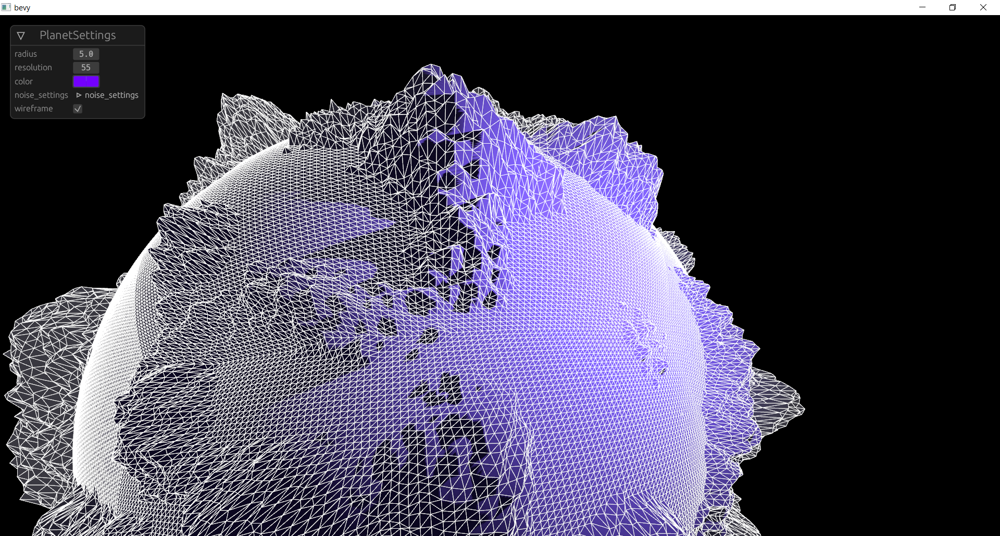

planet-gen
==========

Cube sphere with layered-noise for terrain generation implemented in rust with the [bevy engine](https://github.com/bevyengine/bevy).

Checkout repository and run with:

    cargo run --release